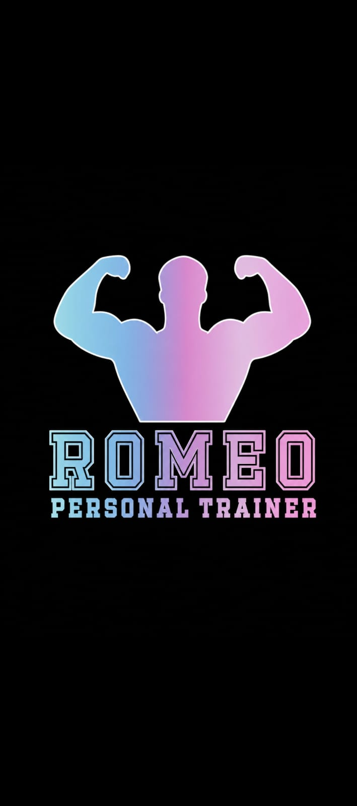

# 🏋️ Romeo Personal Trainer

<div align="center">



**Plataforma web de gestión para entrenadores personales**  
*Controla clientes, rutinas, sesiones en vivo y progreso corporal desde un solo lugar.*


</div>

---

## 📋 Tabla de Contenidos

- [Descripción](#-descripción)
- [Capturas de Pantalla](#-capturas-de-pantalla)
- [Características](#-características)
- [Estructura del Proyecto](#-estructura-del-proyecto)
- [Instalación y Uso](#-instalación-y-uso)
- [Páginas de la Aplicación](#-páginas-de-la-aplicación)
- [Modelos de Datos](#-modelos-de-datos)
- [Design System](#-design-system)
- [Funcionalidades Detalladas](#-funcionalidades-detalladas)
- [Tecnologías Utilizadas](#-tecnologías-utilizadas)

---

## 📖 Descripción

**Romeo Personal Trainer** es una aplicación web de alto rendimiento diseñada específicamente para entrenadores personales. Permite gestionar de forma centralizada todos los aspectos del entrenamiento:

- 👤 **Registro completo de clientes** con medidas corporales y métricas de ingresos
- 🏋️ **Creación de rutinas mensuales** con editor de ejercicios por bloques
- ⏱️ **Sesiones de entrenamiento en vivo** con timer, checklist y volumen en tiempo real
- 📊 **Seguimiento de progreso corporal** con gráficas SVG y comparativas
- 🥗 **Guías nutricionales** con recetas y timing de macronutrientes

> **Sin servidor. Sin base de datos externa. Sin instalación.** Todos los datos se guardan localmente en el navegador mediante `localStorage`.

---

## ✨ Características

### 🎯 Gestión de Clientes (Roster)
- ✅ Registro completo: nombre, edad, género, email, teléfono
- ✅ Medidas corporales: peso, estatura, pecho, cintura, cadera, brazos, muslos
- ✅ IMC calculado automáticamente con categoría diagnóstica
- ✅ Tarifa mensual por cliente → **Revenue total del mes en el dashboard**
- ✅ Objetivos: Perder peso, Ganar músculo, Mantenimiento, Resistencia, Rehabilitación
- ✅ Filtros por objetivo y búsqueda por nombre
- ✅ Barra de completitud semanal por cliente
- ✅ Programación de sesiones con hora y rutina asignada

### 🏋️ Creador de Rutinas
- ✅ Editor de bloques: ejercicio, grupo muscular, series × reps, peso (kg), descanso (s)
- ✅ Biblioteca integrada con +45 ejercicios organizados por grupo muscular
- ✅ Seguimiento de peso inicial y final del mes
- ✅ Tipo de rutina: Fuerza, Hipertrofia, Pérdida de Peso, Resistencia, Funcional
- ✅ Recomendaciones del entrenador por rutina
- ✅ Vista de historial mensual expandible
- ✅ Acceso directo a iniciar sesión desde la rutina

### ⚡ Entrenamiento en Vivo
- ✅ **Timer de sesión** con contador de tiempo real
- ✅ **Checklist de ejercicios** — cada serie es un ítem verificable
- ✅ **Volumen total** calculado en tiempo real (sets completados × kg)
- ✅ **Calorías estimadas** basadas en duración de la sesión
- ✅ **Ring de progreso** — % visual de sets completados
- ✅ **Timer de descanso** automático al completar cada serie
- ✅ **Citas motivacionales** rotativas al inicio de cada sesión
- ✅ Guardado automático en historial al terminar

### 📊 Seguimiento Corporal
- ✅ Registro de mediciones periódicas con fecha
- ✅ **Gráfica SVG** de evolución del peso
- ✅ Comparativa automática: medidas iniciales vs actuales
- ✅ Historial completo de mediciones con variación respecto al registro anterior

### 🥗 Nutrición
- ✅ 12 recetas organizadas por categoría (Alta Proteína, Pre-Entreno, Recuperación, Snacks)
- ✅ Macronutrientes por receta: proteína, carbos, grasas, calorías
- ✅ Lista detallada de ingredientes en modal
- ✅ Guía de macros diarios recomendados
- ✅ Guía de timing nutricional (pre/post entreno, nocturno)

### 📈 Dashboard Estratégico
- ✅ **KPIs en tiempo real**: Clientes activos, Sesiones hoy, Completitud promedio, Ingresos/mes
- ✅ **Gráfico de barras SVG** — Volumen de entrenamiento semanal (últimas 4 semanas)
- ✅ **Donut de retención** — % de clientes con sesiones completadas
- ✅ Lista de sesiones programadas para el día
- ✅ Accesos rápidos a las acciones más comunes

---

## 📁 Estructura del Proyecto

```
GYM/
│
├── 📄 index.html           # Dashboard principal con KPIs y gráficos
├── 📄 usuarios.html        # Roster de clientes con métricas
├── 📄 rutinas.html         # Creador de rutinas mensuales
├── 📄 entrenamiento.html   # Sesión en vivo con timer y checklist
├── 📄 progreso.html        # Seguimiento corporal con gráficas
├── 📄 recetas.html         # Nutrición y guías alimenticias
│
├── 🎨 styles.css           # Sistema de diseño completo (Design System)
├── ⚙️  shared.js            # Lógica compartida, modelos de datos, utilidades
│
├── 🖼️  1.jpeg              # Logo principal (oscuro con gradiente)
└── 🖼️  2.jpeg              # Logo alternativo (rojo/blanco)
```

---

## 🚀 Instalación y Uso

### Requisitos
- Cualquier navegador moderno (Chrome, Firefox, Edge, Safari)
- **No requiere servidor, Node.js, ni dependencias externas**

### Pasos

1. **Descarga o clona el repositorio:**
   ```bash
   git clone https://github.com/tu-usuario/romeo-personal-trainer.git
   ```
   — o —
   Descarga el ZIP y extrae en una carpeta.

2. **Abre la aplicación:**
   - Haz doble clic en `index.html`
   - O arrastra el archivo al navegador

3. **¡Listo!** No requiere configuración adicional.

> ⚠️ **Nota sobre datos:** Toda la información se guarda en el `localStorage` del navegador. No borres los datos del sitio en la configuración del navegador para conservar tus registros. Se recomienda usar siempre el mismo navegador y perfil.

---

## 📱 Páginas de la Aplicación

### 🏠 Dashboard (`index.html`)
Vista estratégica del negocio con métricas en tiempo real.

| Elemento | Descripción |
|---|---|
| **Hero Banner** | Logo y cita motivacional del día |
| **KPI: Clientes Activos** | Total de clientes registrados |
| **KPI: Sesiones Hoy** | Sesiones programadas para el día actual |
| **KPI: Completitud %** | Promedio de rutinas completadas entre todos los clientes |
| **KPI: Ingresos / Mes** | Suma de tarifas mensuales de todos los clientes |
| **Gráfico de Volumen** | Barras SVG con volumen de entrenamiento semanal |
| **Donut de Retención** | % de clientes con sesiones completadas |
| **Sesiones de Hoy** | Lista cronológica de sesiones del día |
| **Accesos Rápidos** | Links a Nuevo Cliente, Crear Rutina, Iniciar Sesión, Nutrición |

---

### 👥 Clientes (`usuarios.html`)
Gestión completa del roster de clientes.

**Barra de Resumen:**
- Clientes Totales · Ingresos/Mes · Completitud Promedio · Rutinas Activas

**Filtros por Objetivo:**
`Todos` · `Perder Peso` · `Ganar Músculo` · `Mantenimiento` · `Resistencia`

**Cada tarjeta de cliente muestra:**
- Avatar con iniciales (color único por cliente)
- Nombre, edad, género y nivel de experiencia
- Tarifa mensual (si está configurada)
- Peso · Estatura · IMC
- Barra de progreso de completitud semanal
- Próxima sesión programada
- Acciones: Ver Perfil · Programar Sesión · Editar · Eliminar

---

### 🏋️ Rutinas (`rutinas.html`)
Creador de planes de entrenamiento mensual.

**Configuración de la Rutina:**
- Nombre · Mes · Año · Tipo · Grupo Muscular · Días/Semana
- Peso Inicial y Final del mes
- Biblioteca de ejercicios integrada (+45 ejercicios)

**Editor de Bloques:**
```
# | Ejercicio | Grupo Muscular | Series×Reps | Peso(kg) | Descanso(s) | Notas
```
Cada ejercicio se agrega como un bloque independiente.

---

### ⚡ Entrenamiento (`entrenamiento.html`)
Modo de sesión en vivo para el entrenamiento.

**Flujo de uso:**
1. Selecciona el cliente y su rutina asignada
2. Haz clic en **"Iniciar Sesión"**
3. Verifica cada serie en el checklist
4. El timer de descanso se activa automáticamente
5. Al completar todos los sets → pantalla de celebración
6. **"Terminar Sesión"** guarda la sesión en el historial

**Métricas en tiempo real:**
| Métrica | Cálculo |
|---|---|
| ⏱ Tiempo | Cronómetro desde que inicia la sesión |
| 🏋️ Volumen | Suma de (reps × kg) de cada set completado |
| 🔥 Calorías | ~7 kcal/minuto estimadas para entrenamiento de fuerza |
| ✅ Completado | (Sets completados / Total de sets) × 100 |

---

### 📊 Progreso (`progreso.html`)
Seguimiento de evolución física.

- Gráfica SVG de peso a lo largo del tiempo
- Tabla comparativa: medidas iniciales vs actuales
- Historial con variación respecto a la medición anterior

---

### 🥗 Nutrición (`recetas.html`)
Guía nutricional con 12 recetas categorizadas.

**Categorías:** Alta Proteína · Pre-Entreno · Recuperación · Snacks

**Cada receta incluye:**
- Macronutrientes (Proteína / Carbos / Grasas / Calorías)
- Lista completa de ingredientes
- Guía de timing nutricional (pre/post entreno, nocturno)

---

## 🗄️ Modelos de Datos

Todos los datos se guardan en `localStorage` bajo la clave `romeo_db`.

### Usuario
```json
{
  "id": "string",
  "nombre": "Juan García López",
  "edad": 28,
  "genero": "Masculino",
  "email": "juan@email.com",
  "telefono": "+57 300 000 0000",
  "tarifa": 150000,
  "peso": 78.5,
  "estatura": 178,
  "pecho": 98, "cintura": 84, "cadera": 96,
  "brazoIzq": 36, "brazoDer": 36,
  "musloIzq": 58, "musloDer": 58,
  "pantorrilla": 38,
  "objetivo": "Ganar músculo",
  "nivel": "Intermedio",
  "obs": "Lesión previa en hombro derecho",
  "creado": "2025-01-15T10:00:00Z"
}
```

### Rutina
```json
{
  "id": "string",
  "usuarioId": "string",
  "nombre": "Programa de Fuerza — Mes 1",
  "mes": "Enero",
  "anio": 2025,
  "tipo": "Hipertrofia",
  "grupo": "Pecho + Tríceps",
  "dias": "4",
  "pesoIni": 78.5,
  "pesoFin": 76.0,
  "ejercicios": [
    {
      "nombre": "Press de banca",
      "grupo": "Pecho",
      "series": "4 × 10",
      "peso": "80",
      "descanso": "90",
      "notas": "Agarre ancho"
    }
  ],
  "notas": "Aumentar carga 2.5kg cada semana si completa todas las series",
  "creado": "2025-01-15T10:00:00Z"
}
```

### Sesión de Entrenamiento
```json
{
  "id": "string",
  "usuarioId": "string",
  "rutinaId": "string",
  "fecha": "2025-01-20",
  "hora": "08:00",
  "estado": "completada",
  "duracionSeg": 3240,
  "volumenKg": 8500,
  "setsCompletados": 24,
  "setsTotal": 24,
  "notas": ""
}
```

### Progreso Corporal
```json
{
  "id": "string",
  "usuarioId": "string",
  "fecha": "2025-01-20",
  "peso": 77.0,
  "pecho": 97, "cintura": 82, "cadera": 95,
  "brazoIzq": 37, "brazoDer": 37,
  "musloIzq": 59, "musloDer": 59,
  "pantorrilla": 38,
  "notas": "Cliente reporta más energía"
}
```

---

## 🎨 Design System

Basado en el PRD de **Romeo Personal Trainer / Vanguard Fitness**.

### Paleta de Colores
| Variable | Color | Uso |
|---|---|---|
| `--bg` | `#131313` | Fondo principal |
| `--bg-card` | `#1c1c1c` | Fondo de tarjetas |
| `--bg-surface` | `#222222` | Superficies secundarias |
| `--pink` | `#FF3CAC` | Acento principal (botones, KPIs) |
| `--blue` | `#2B86C5` | Acento secundario |
| `--purple` | `#784BA0` | Color intermedio del gradiente |
| `--green` | `#00E5A0` | Éxito, completitud |
| `--red` | `#FF4560` | Errores, eliminación |

### Gradiente Principal
```css
--grad-main: linear-gradient(135deg, #FF3CAC 0%, #784BA0 50%, #2B86C5 100%);
```

### Tipografía
```css
font-family: 'Sora', sans-serif;
/* Pesos: 300, 400, 500, 600, 700, 800 */
```

---

## 🔧 Funcionalidades Detalladas

### Persistencia de Datos
```javascript
// Guardar
localStorage.setItem('romeo_db', JSON.stringify(DB));

// Cargar (con migración automática desde 'gymproDB')
const s = localStorage.getItem('romeo_db');
if (s) DB = JSON.parse(s);
```

### Cálculo de Revenue
```javascript
function calcRevenue() {
  return DB.usuarios.reduce((sum, u) => sum + (parseFloat(u.tarifa) || 0), 0);
}
```

### Cálculo de Completitud
```javascript
function calcCompletitudUsuario(uid) {
  const sesiones = DB.sesiones.filter(s => s.usuarioId === uid);
  const completadas = sesiones.filter(s => s.estado === 'completada').length;
  return Math.round((completadas / sesiones.length) * 100);
}
```

### Volumen de Entrenamiento
El volumen se calcula sumando: **Series × Repeticiones × Peso (kg)** de cada set completado durante la sesión en vivo.

### Timer de Descanso
Al marcar un set como completado, se activa automáticamente un contador con el tiempo de descanso configurado en la rutina (por defecto 60 segundos).

---

## 🛠️ Tecnologías Utilizadas

| Tecnología | Uso | Versión |
|---|---|---|
| **HTML5** | Estructura de todas las páginas | Semántico |
| **CSS3** | Sistema de diseño, animaciones, responsive | Variables CSS, Grid, Flexbox |
| **JavaScript (Vanilla)** | Lógica de negocio, DOM, localStorage | ES6+ |
| **SVG** | Gráficos de barras, donut, líneas | Inline SVG |
| **Google Fonts** | Tipografía Sora | Variable |
| **localStorage** | Persistencia de datos sin servidor | Web API |

> **Sin frameworks. Sin librerías externas. Sin dependencias npm.**  
> Funciona directamente como archivos HTML estáticos.

---

## 📱 Responsive Design

La aplicación es completamente responsive con breakpoints en:

| Breakpoint | Comportamiento |
|---|---|
| `> 1200px` | Layout completo con sidebar fija |
| `768px – 1200px` | Grid reducido a 2 columnas, sidebar permanente |
| `< 768px` | Sidebar colapsable con botón de menú (hamburger) |
| `< 480px` | Layout de columna única, tipografía reducida |

---

## 📊 Métricas del Proyecto

| Métrica | Valor |
|---|---|
| Páginas HTML | 6 |
| Líneas de CSS | ~1,500 |
| Líneas de JavaScript | ~900 (shared.js + scripts inline) |
| Recetas incluidas | 12 |
| Ejercicios en biblioteca | 45+ |
| Citas motivacionales | 8 |
| Dependencias externas | **0** |

---

## 🔮 Posibles Mejoras Futuras

- [ ] **Exportar a PDF** — Imprimir rutinas y reportes de progreso
- [ ] **Fotos de progreso** — Capturar imágenes de clientes por fecha
- [ ] **Notificaciones push** — Recordatorios de sesión (requiere Service Worker)
- [ ] **Modo offline** — PWA con Service Worker para instalación en móvil
- [ ] **Sincronización en la nube** — Firebase o Supabase para backup
- [ ] **Calculadora de macros** — Personalizada por peso y objetivo
- [ ] **Plantillas de rutinas** — Banco de rutinas prediseñadas
- [ ] **Estadísticas avanzadas** — Récords personales, PR tracking
- [ ] **Multi-usuario** — Acceso diferenciado para cliente y entrenador

---

## 👤 Autor

**Romeo Personal Trainer**  
*Plataforma desarrollada para la gestión profesional del entrenamiento personalizado.*

---

<div align="center">

Hecho con 💪 y mucha dedicación

*"El único mal entrenamiento es el que no hiciste."*

</div>
